

   
  

<h1 align="center">N X I V E &nbsp; S E N D E R</h1>

<strong>Send anything. To anyone. No cloud. No limits.</strong>

  
  &nbsp;&nbsp;
  
  &nbsp;&nbsp;
  
  &nbsp;&nbsp;
  

  <a href="https://sender.nxive.com">Website</a>
  &nbsp;&nbsp;&bull;&nbsp;&nbsp;
  <a href="https://sender.nxive.com/docs">Docs</a>
  &nbsp;&nbsp;&bull;&nbsp;&nbsp;
  <a href="https://sender.nxive.com/changelog">Changelog</a>
  &nbsp;&nbsp;&bull;&nbsp;&nbsp;
  <a href="https://sender.nxive.com/privacy">Privacy</a>
  &nbsp;&nbsp;&bull;&nbsp;&nbsp;
  <a href="https://sender.nxive.com/terms">Terms</a>

---

  <em>
    Free, encrypted, peer-to-peer file transfer. 
    No internet required. No file size limits. No accounts. 
    Install on two devices. Connect to the same network. Send. That's it.
  </em>

---

  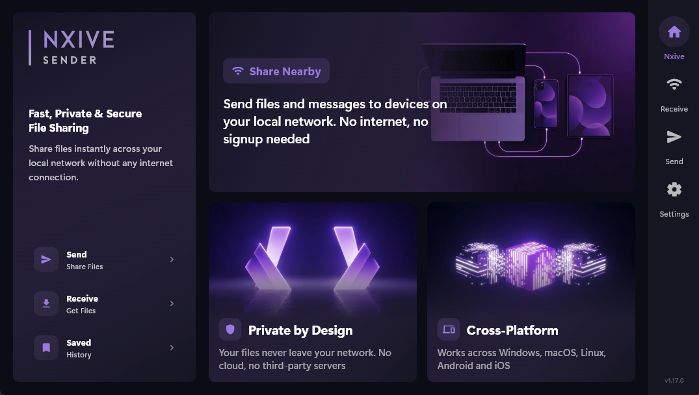

---

<h2 align="center">D E S K T O P</h2>

<table align="center">
  <tr>
    <td align="center">
      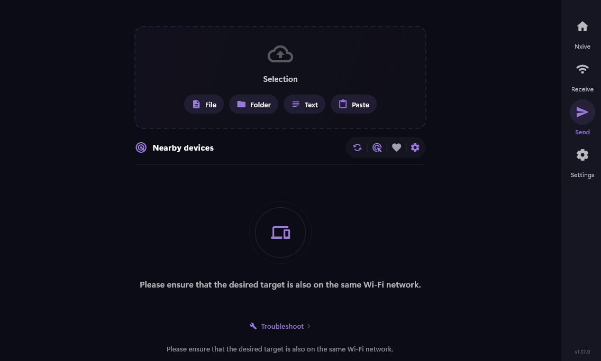 
      <strong>Send</strong> &mdash; Select files, folders, or text
    </td>
    <td align="center">
      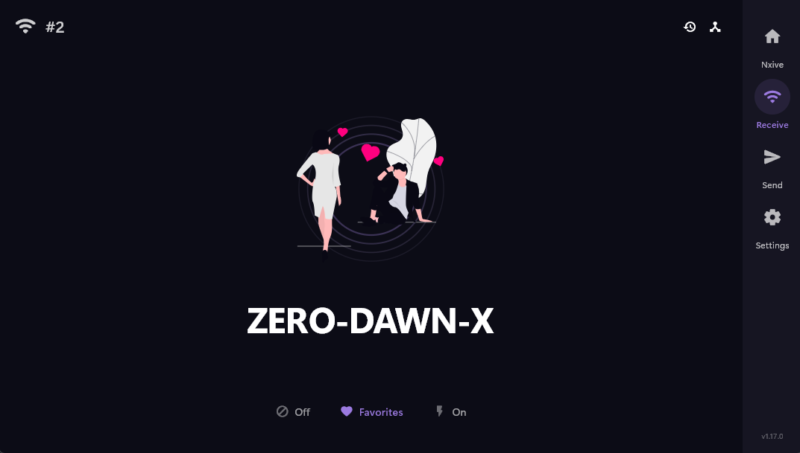 
      <strong>Receive</strong> &mdash; Waiting for response
    </td>
  </tr>
  <tr>
    <td align="center">
      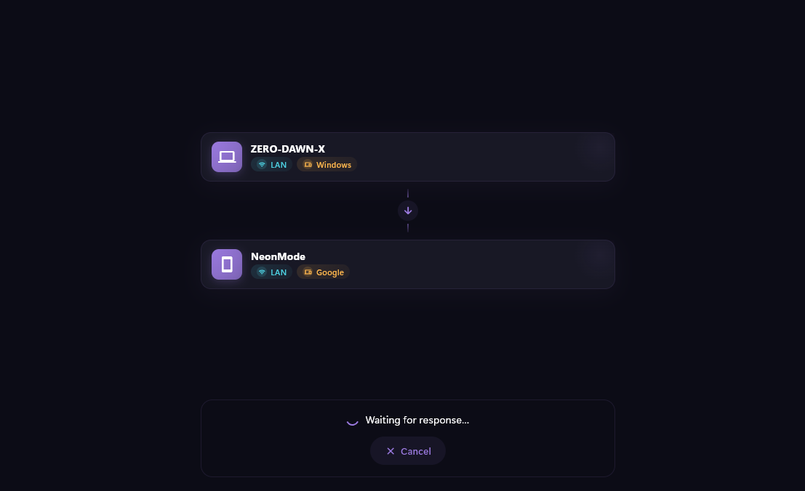 
      <strong>Transfer</strong> &mdash; Device-to-device connection
    </td>
    <td align="center">
      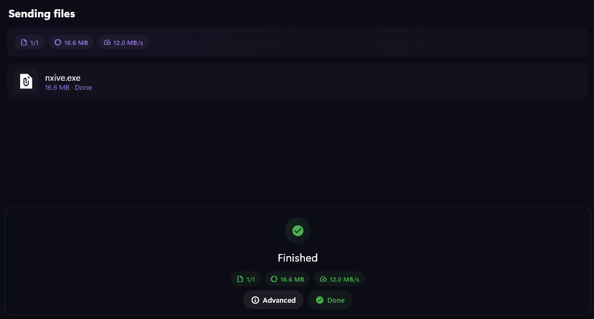 
      <strong>Done</strong> &mdash; Transfer complete
    </td>
  </tr>
</table>

---

<h2 align="center">M O B I L E</h2>

<table align="center">
  <tr>
    <td align="center">
      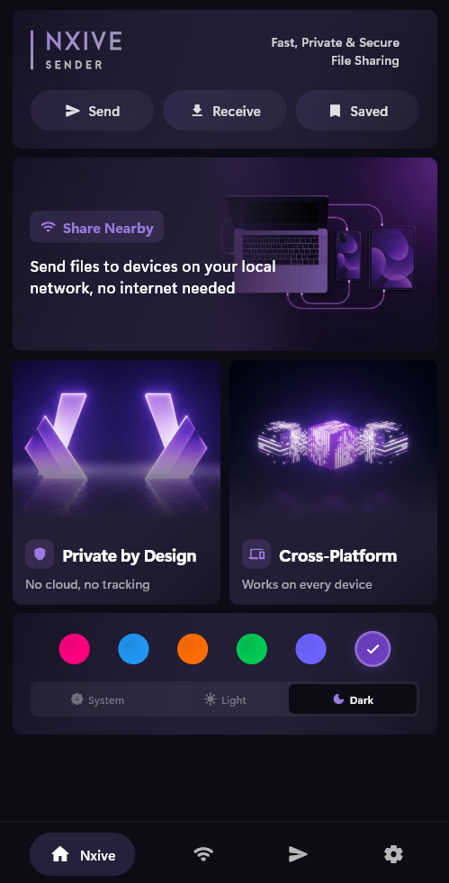 
      <strong>Home</strong>
    </td>
    <td align="center">
      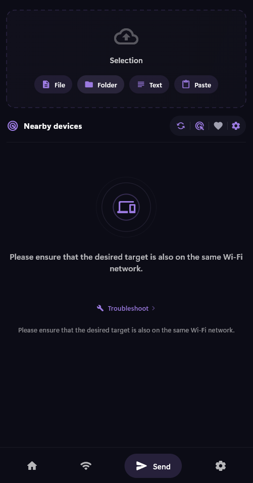 
      <strong>Send</strong>
    </td>
    <td align="center">
      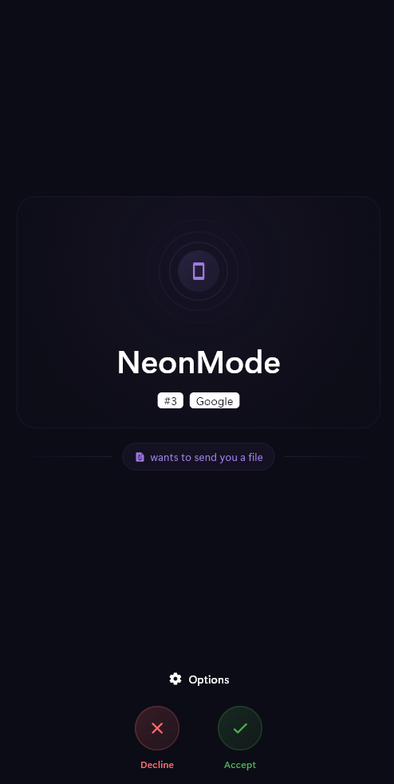 
      <strong>Receive</strong>
    </td>
    <td align="center">
      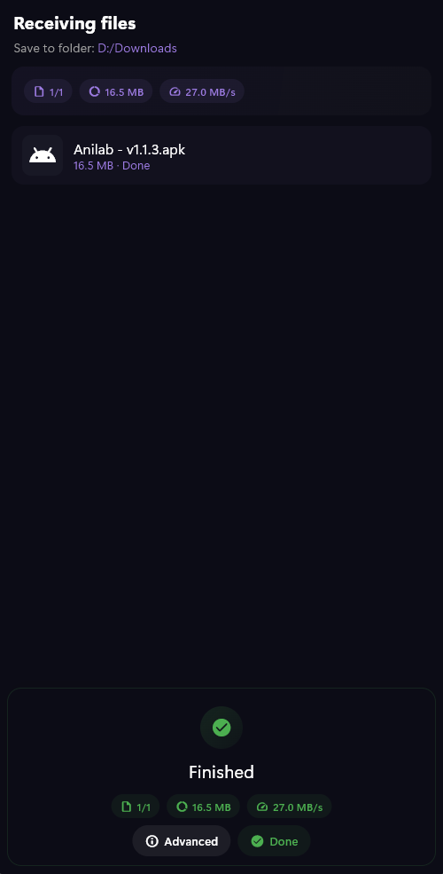 
      <strong>Done</strong>
    </td>
  </tr>
</table>

---

<h2 align="center">T H E M E S</h2>

  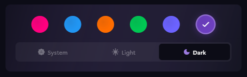

<table align="center">
  <tr>
    <td align="center">
      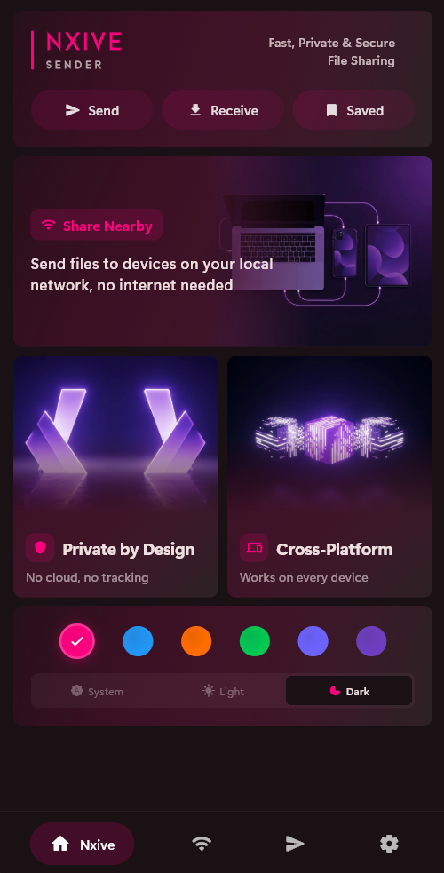 
      <strong>Some of the themes</strong>
    </td>
    <td align="center">
      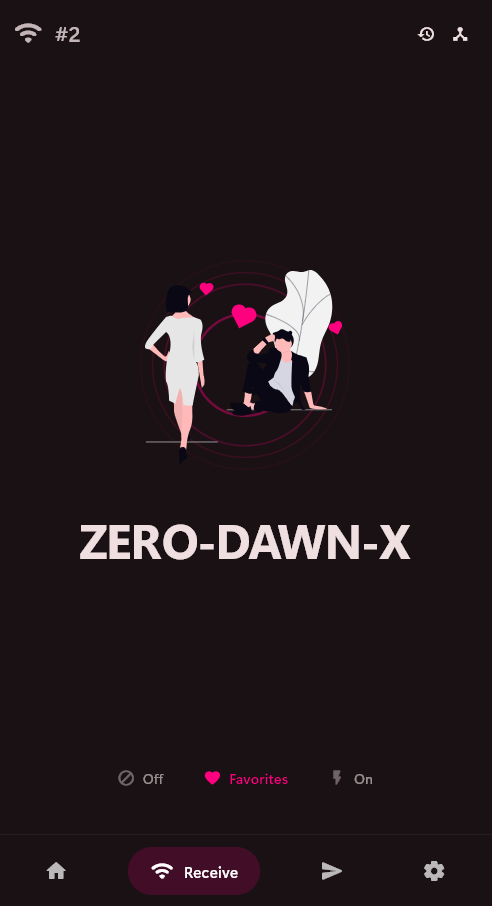 
      <strong>Some of the themes</strong>
    </td>
    <td align="center">
      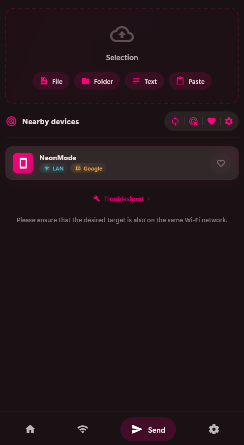 
      <strong>Some of the themes</strong>
    </td>
  </tr>
</table>

---

<h2 align="center">D O W N L O A D S</h2>

<h4 align="center">Windows</h4>

| | File | Architecture |
|:---:|:---|:---|
| **Installer** | [`NxiveSender-Setup.exe`](downloads/NxiveSender-Setup.exe) | x86-64 |
| **Portable** | [`NxiveSender-Windows-x64.zip`](downloads/NxiveSender-Windows-x64.zip) | x86-64 |

<h4 align="center">Android</h4>

| | File | Notes |
|:---:|:---|:---|
| **ARM64** | [`NxiveSender-arm64.apk`](downloads/NxiveSender-arm64.apk) | Most devices (2018+) |
| **ARMv7** | [`NxiveSender-armv7.apk`](downloads/NxiveSender-armv7.apk) | Older devices |
| **x86_64** | [`NxiveSender-x86_64.apk`](downloads/NxiveSender-x86_64.apk) | Emulators |

<h4 align="center">macOS & Linux</h4>

Coming soon.

---

<h2 align="center">H O W &nbsp; I T &nbsp; W O R K S</h2>

<table align="center">
  <tr>
    <td align="center" width="180">
      <strong>01</strong>  
      <strong>Install</strong> 
      Both devices need Nxive Sender
    </td>
    <td align="center" width="40">&rarr;</td>
    <td align="center" width="180">
      <strong>02</strong>  
      <strong>Connect</strong> 
      Same WiFi or LAN network
    </td>
    <td align="center" width="40">&rarr;</td>
    <td align="center" width="180">
      <strong>03</strong>  
      <strong>Select</strong> 
      Pick any files or folders
    </td>
    <td align="center" width="40">&rarr;</td>
    <td align="center" width="180">
      <strong>04</strong>  
      <strong>Done</strong> 
      Instant transfer, device to device
    </td>
  </tr>
</table>

No servers. No configuration. No accounts.

---

<h2 align="center">F E A T U R E S</h2>

<table align="center">
  <tr>
    <td align="center" width="440">
      <strong>Peer-to-peer</strong> 
      Direct device-to-device over local network
    </td>
    <td align="center" width="440">
      <strong>Offline</strong> 
      No internet connection required
    </td>
  </tr>
  <tr>
    <td align="center">
      <strong>Unlimited</strong> 
      No file size restrictions
    </td>
    <td align="center">
      <strong>Encrypted</strong> 
      End-to-end, your data stays private
    </td>
  </tr>
  <tr>
    <td align="center">
      <strong>Zero accounts</strong> 
      No sign-up, no login, no tracking
    </td>
    <td align="center">
      <strong>Cross-platform</strong> 
      Windows, Android. macOS, Linux soon
    </td>
  </tr>
  <tr>
    <td align="center">
      <strong>Any file</strong> 
      Documents, media, archives, installers
    </td>
    <td align="center">
      <strong>Folders</strong> 
      Send entire directories at once
    </td>
  </tr>
</table>

---

<h2 align="center">R E Q U I R E M E N T S</h2>

| Platform | Minimum Version |
|:---:|:---:|
| **Windows** | 10 or later |
| **Android** | 8.0 Oreo or later |
| **macOS** | 11 Big Sur or later *(coming soon)* |
| **Linux** | Ubuntu 20.04+ / Fedora 36+ *(coming soon)* |

---

<h2 align="center">R O A D M A P</h2>

| Platform | Status | Progress |
|:---:|:---:|:---:|
| **Windows** | Shipped | `##########` |
| **Android** | Shipped | `##########` |
| **macOS** | In Progress | `####------` |
| **Linux** | In Progress | `####------` |
| **iOS** | Planned | `----------` |

---

<h2 align="center">C R E D I T S</h2>

  Nxive Sender is built on <a href="https://github.com/localsend/localsend">LocalSend</a>,
  created by <strong>Tien Do Nam</strong> (<a href="https://github.com/Tienisto">@Tienisto</a>). 
  The core engine exists because of his work and the open-source community around it.

<strong>Core Contributors</strong>

| Name | Commits |
|:---|---:|
| Tien Do Nam | 1170 |
| ShlomoCode | 58 |
| sergd88 | 53 |
| TheGB0077 | 28 |
| gidano | 22 |
| nkh0472 | 20 |
| soya daizu | 18 |
| Varkalion | 17 |
| Matthaiks | 14 |
| Neo1102 | 13 |
| nebojsatomic | 12 |
| Nixuge | 11 |
| Amereyeu | 11 |
| mertssmnoglu | 10 |
| BryanJames16 | 9 |
| graphemecluster | 9 |

And 200+ community contributors through code, translations, and ideas.

  
    <strong>License</strong> &mdash; LocalSend is released under the Apache License 2.0.
    Copyright 2022-2024 Tien Do Nam. 
    Nxive Sender is built upon this foundation with full respect for the original license.
  

---

<h2 align="center">S O U R C E</h2>

  This repository provides official releases and downloads only. 
  The source code is not publicly available at this time.

---

 

  <strong>N X I V E</strong> 
  <a href="https://nxive.com">nxive.com</a>

 
